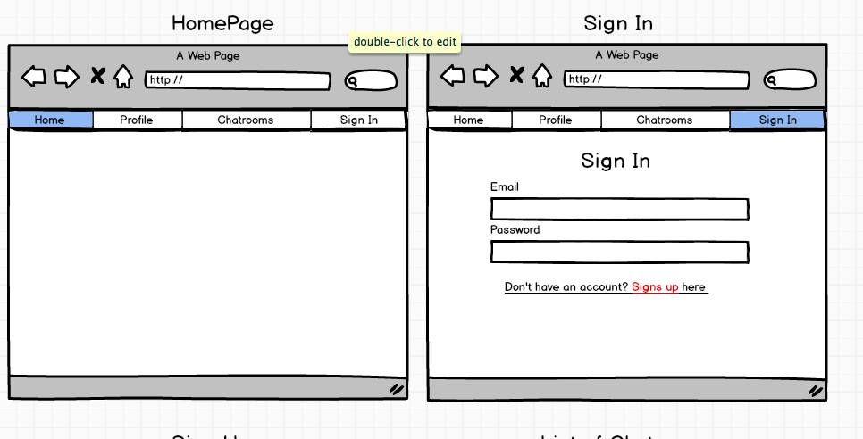
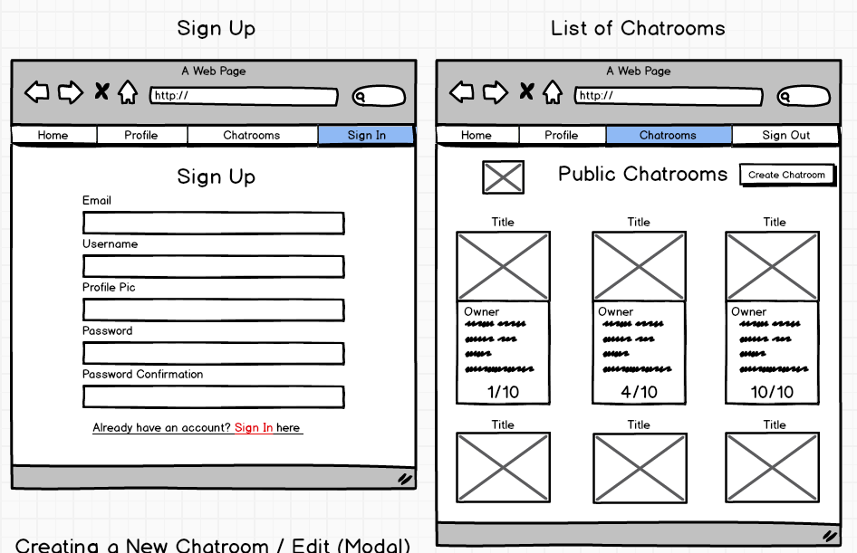
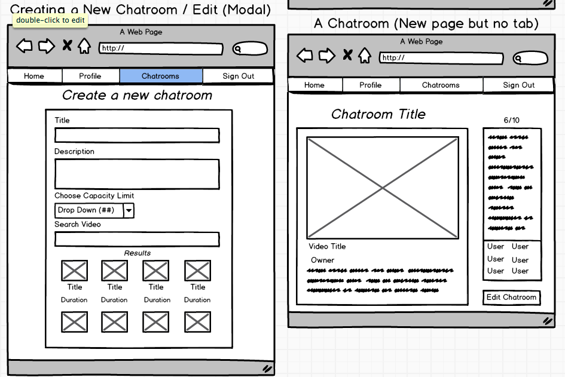

#JoinMe

###Models
--
- <b>User</b>
	- <b>email:</b> String
	- <b>username:</b> String
	- <b>picture_url:</b> String
- <b>Chatroom</b>
	- <b>title:</b> String
	- <b>creator:</b> [referencing Users]
	- <b>creatorName:</b> String
	- <b>video:</b> String
	- <b>description:</b> String
	- <b>userCapacity:</b> Number
	- <b>users:</b> [referencing Users]

##Wireframes

